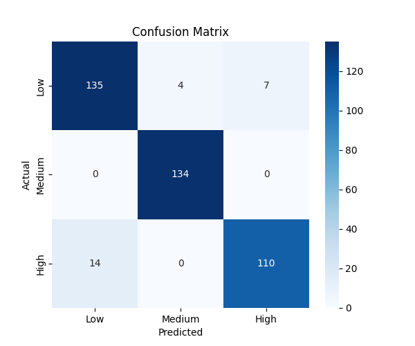

# Student Life Balance

## Overview

This project predicts students' health status based on various factors, including:

- Gender
- Age
- Blood pressure
- Stress level
- Physical activity
- Sleep quality
- Study and project hours
- Other relevant indicators

By inputting a student's information, the model determines their health risk level. The prediction model is trained using the **Decision Tree** algorithm, aiming to classify students' health conditions based on the provided features.

## Dataset

The dataset used for this project can be found at:
[Student Health Dataset](https://www.kaggle.com/datasets/ziya07/student-health-data)

## Installation

First, you need to clone the repository:

```
git clone https://github.com/BaoPhuc1311/StudentLifeBalance.git
cd StudentLifeBalance
```

Next, you install the required libraries by running `requirements.txt` file:

```
pip install -r requirements.txt
```

## Usage

Once the installation is complete, you can run the application with:

```
python src/main.py
```

## Model Performance

After training the Decision Tree model, the evaluation results are:

- **Accuracy Score**: `0.98`
- **Precision, Recall, F1-score**:

precision    recall  f1-score   support

       0       1.00      0.91      0.95        32
       1       1.00      0.98      0.99        47
       2       0.97      1.00      0.98       121

## Visualization Data


